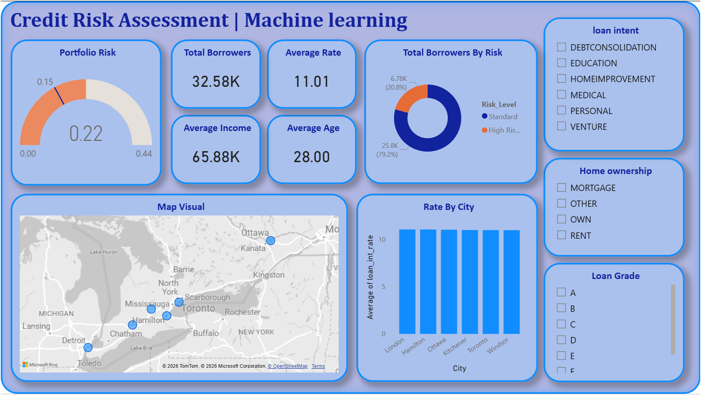
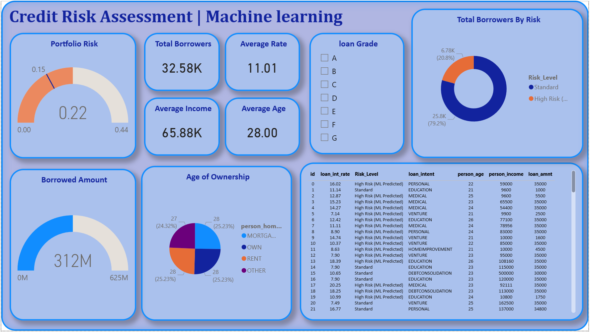

# 🇨🇦 Autonomous Credit Risk & ML-Powered Stress Testing Pipeline
**An End-to-End Predictive Analytics Suite for Retail Banking**

[](https://www.python.org/)
[](https://scikit-learn.org/)
[](https://www.microsoft.com/en-us/sql-server/)
[](https://powerbi.microsoft.com/)

## 📌 Executive Summary
This repository features an autonomous **Credit Risk Intelligence System** that moves beyond static financial reporting into **Predictive Modeling**. The pipeline automates the ingestion of 32,000+ records, trains a **Random Forest Classifier** to identify hidden default patterns, and injects results into a local SQL Server Star Schema for executive-level visualization.

By shifting from rule-based logic (DTI thresholds) to **Probability-based Scoring**, this system identifies "non-obvious" risks that traditional banking filters often miss.



---

## 🏗️ System Architecture
The system is built as a single-stream automation engine, moving data from raw sources to a structured analytics warehouse.

### 1. The ETL & ML Engine (`/script/credit_assesment_ML.py`)
The Python core serves as the central nervous system:
* **Extraction:** Ingestion of the [Kaggle Credit Risk Dataset](https://www.kaggle.com/datasets/laotse/credit-risk-dataset).
* **Machine Learning Transformation:**
    * **Preprocessing:** Median imputation for missing numeric values and Label Encoding for categorical features (Home Ownership, Loan Intent).
    * **Model Training:** Utilizes a **Random Forest Classifier** (100 estimators) to learn historical default patterns.
    * **Predictive Scoring:** Generates a continuous **Default_Probability** score (0.0 to 1.0) for every active loan.
* **Loading:** Utilizes `SQLAlchemy` to automate SQL injection, generating a relational Star Schema in MS SQL Server.

### 2. Data Warehousing (Star Schema)
The pipeline automatically structures the database into two distinct tables:
* **Fact_Credit_Risk:** Individualized loan performance data, credit history, and **ML-predicted risk metrics**.
* **Dim_Locations:** Regional dimension table containing latitude/longitude coordinates for Ontario municipalities.

---

## 📊 Analytics & BI Features
The **Credit Risk Assesment.pbix** dashboard provides a "Command Center" view of portfolio health:
* **Predictive Gauge:** Real-time visualization of the average portfolio default probability.
* **Geographic Risk Heatmap:** Dynamic bubble mapping showing risk concentration in the Windsor-Toronto corridor.
* **Venture Sector Deep-Dive:** Slicers that reveal how the ML model identifies specific loan intents as higher risk compared to standard benchmarks.



---

## 📂 Repository Structure
```text
.
├── script/
│   └── credit_assesment_ML.py   # ETL & Machine Learning Pipeline
├── images/
│   ├── main.png                # Dashboard Overview
│   └── details.png             # Underwriter Deep-Dive
├── csv/
│   └── (Data files)            # Ignored via .gitignore
├── Credit Risk Assesment ML.pbix  # Master Power BI Dashboard
├── .gitignore                  # Prevents large data uploads
└── README.md                   # Documentation
```

## 🛠️ Installation & Deployment

### Prerequisites

- Python 3.11+
- MS SQL Server (Express/Developer)
- Power BI Desktop

### Setup

1. **Clone the Repository:**

   ```bash
   git clone https://github.com/Royster393/Credit-Risk-Analytics-Pipeline.git
   ```
### Setup

2. **Install Dependencies:**

   ```bash
   pip install pandas numpy sqlalchemy pyodbc scikit-learn
   ```
3. **Execute Pipeline:**

   Ensure the Kaggle dataset is in the `/csv/` folder. Update the `SERVER_NAME` in `script/credit_assesment_ML.py`, then run:

   ```bash
   python script/credit_assesment_ML.py
   ```
## 👨‍💻 Author

**Joel Roy**  
Computer Science | University of Windsor  
Specializing in Data Engineering & Cybersecurity

---

## 🚀 Key Improvements in this version:

- **ML Focus:** Specifically mentions **Scikit-Learn** and **Random Forest**, which are keywords recruiters look for.
- **Architecture:** Explains **why** ML is better than the old version (Probability scores vs. static thresholds).
- **Badges:** Added a badge for Scikit-Learn.
- **Clarity:** Uses clear folder structure and deployment steps.
